# Proyecto IDP Request Tracker #
Comenzamos con la instalación de los paquetes necesarios para RT

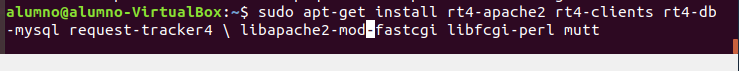

El paquete libapache2-mod-fastcgi ya no tiene repositorio asi que tendremos que descargarlo eh instalarlo manualmente

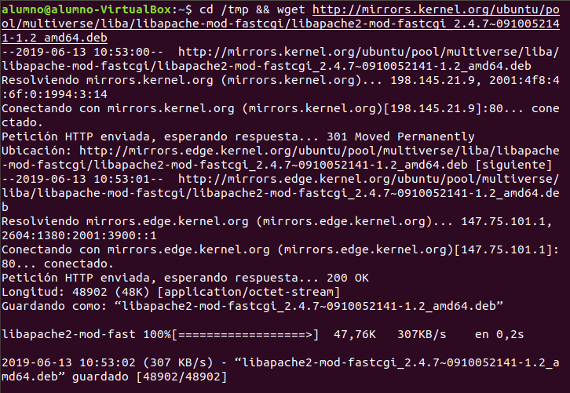

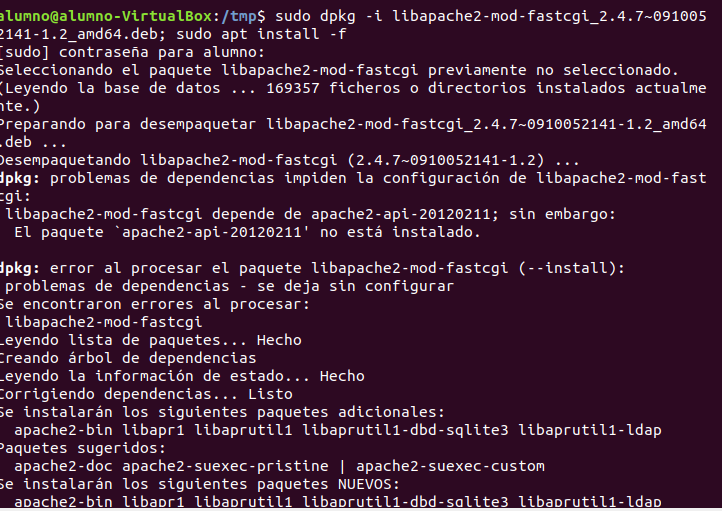

Una ves intalado este paquete tendremos que quitarlo el comando que ejecutamos y volver a ejecutarlo para instalar los demas, ademas tendremos que darle a si cuando se nos pregunte si queremos instalar los paquetes.

Continuamos con la instalación y nos salta la primera ventana de configuración en la que tendremos que reemplazar lo que nos salga por **netmgmt**.

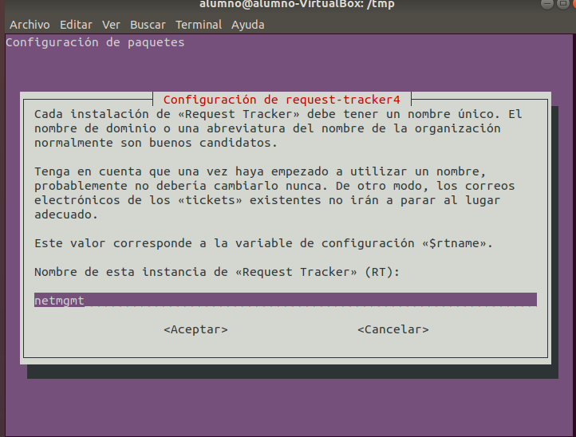

A continuación nos preguntara si queremos configurar la base de datos para request-tracker4 con dbconfig-common a ñp que le daremos que si

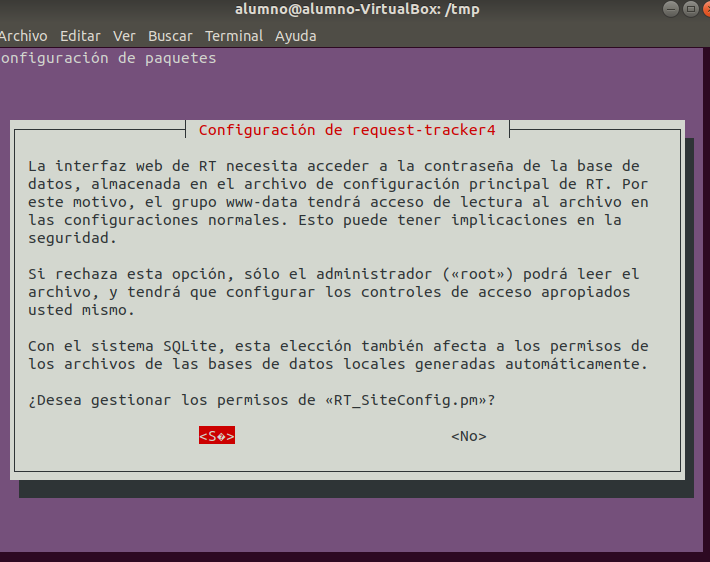

A continuación nos pide crear una contraseña para la base de datos le damos a que si y ponemos la que queramos

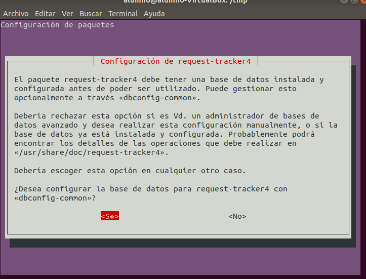

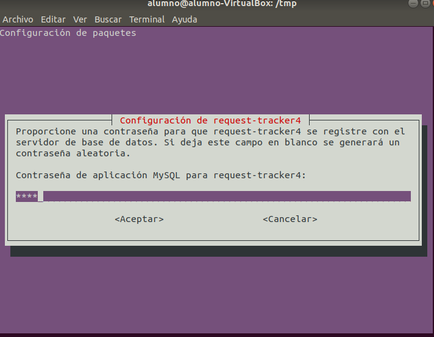

y confirmamos contraseña

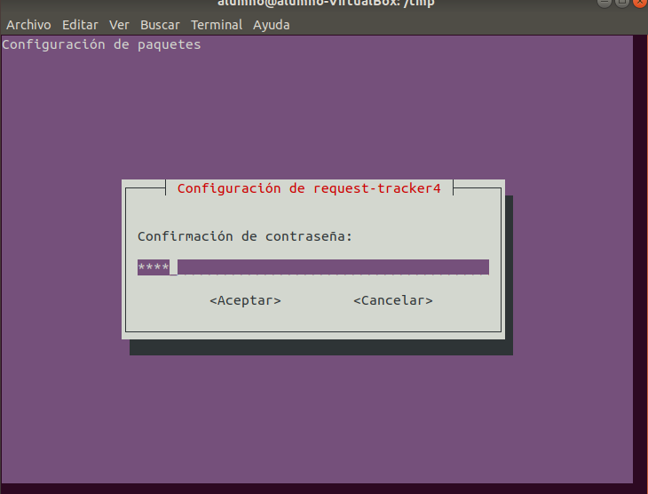

A continuación tendremos que crear una contraseña para el usuario root que sera con el que accederemos posteriormente a la herramienta

confirmamos contraseña

Tendremos que darle contraseña al usuario root de la base de datos, se aconseja dar la misma contraseña para no liarnos

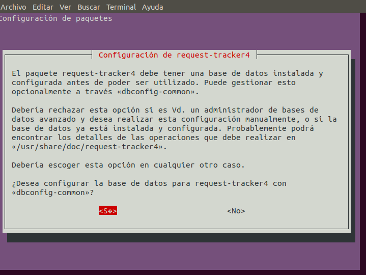

ponemos la contraseña y la confirmamos

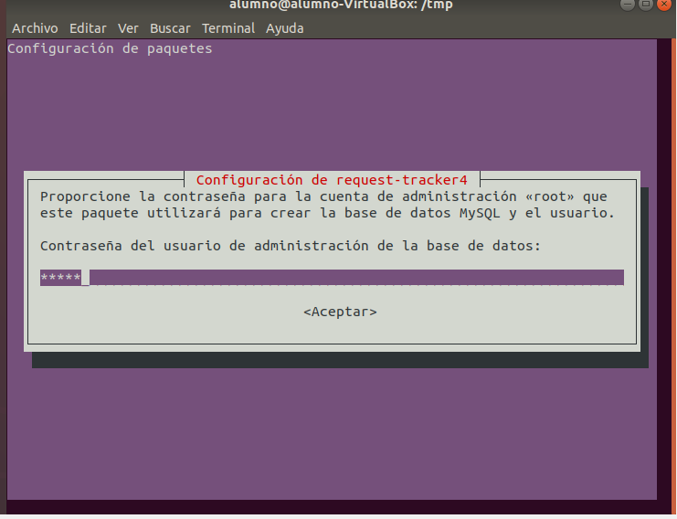

Iremos a este directorio, crearemos un nuevo archivo de configuración llamado 90-local

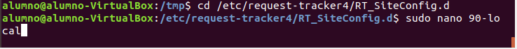

Agregue las siguientes dos líneas al archivo 90-local

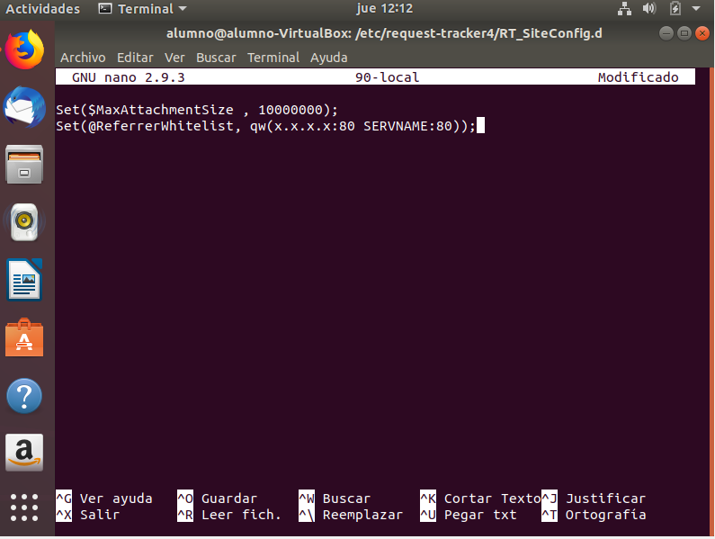

En la entrada de la Lista de referencia de referencia xxxx es la dirección IP de su PC y SERVNAME es el nombre de su PC.
Asegúrese de usar la dirección IP y el nombre correctos para su PC, luego guarde el archivo y ejecute el comando:

- $ sudo update-rt-siteconfig

Por ultimo tenemos que hacer unos ultimos cambios sobre el servidor web apache:
- $ cd /etc/apache2/conf-available
- $ sudo ln -s /etc/request-tracker4/apache2-modperl2.conf rt4.conf
- $ sudo a2enconf rt4 
- $ sudo service apache2 restart

Inicie sesión en RT como usuario root via web:

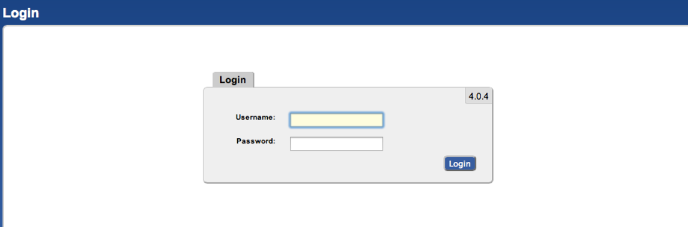

A continuación mostrare pestañas y rutas donde podemos configurar las siguientes cosas:

- **CREAR USUARIO: Herramientas => Configuración => Usuarios**

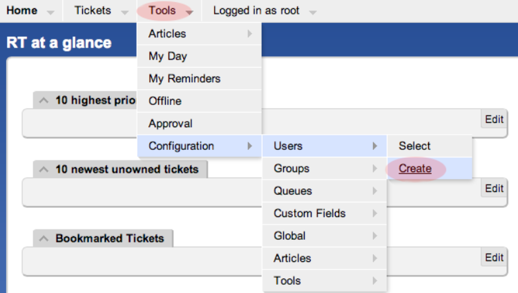

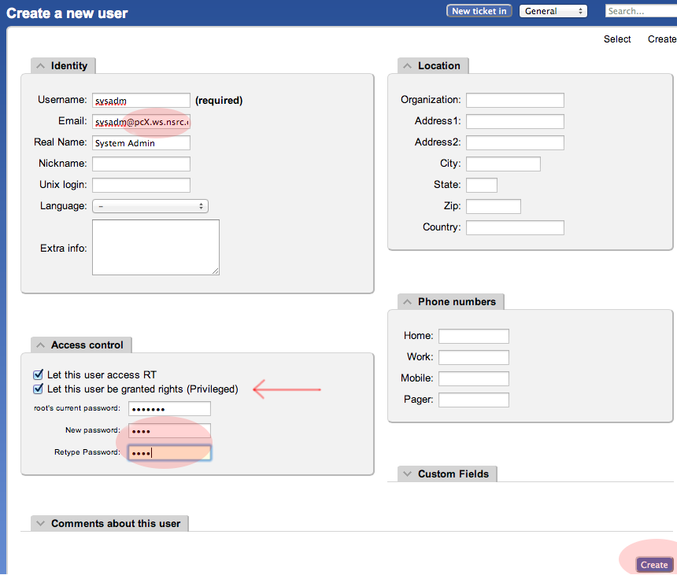

- **CREAR GRUPO DE USUARIO: Herramientas => Configuración => Grupo => Crear**

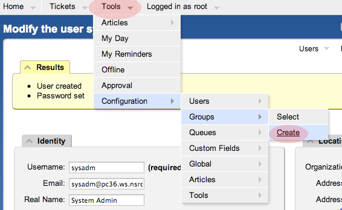

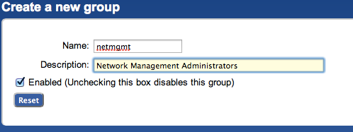

- **AGREGAR UN USUARIO A UN GRUPO**

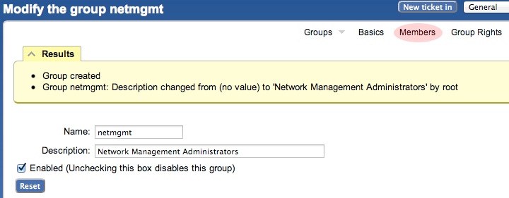

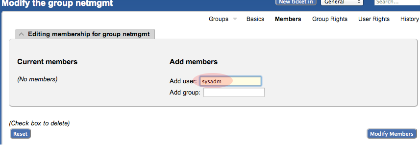

- **CREAR COLAS: Herramientas => Configuración => Cola => Crear**

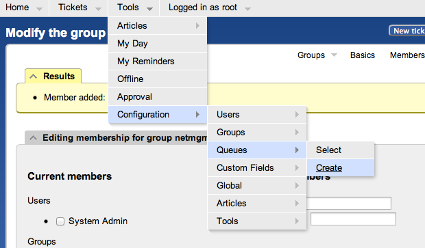

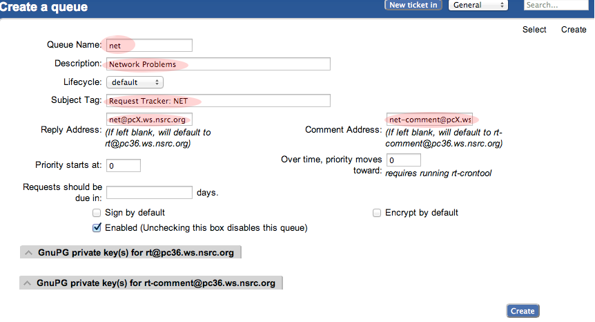

- **Dar derechos a nuestro grupo en la cola: Herramientas => Configuración => Cola => Seleccionar**

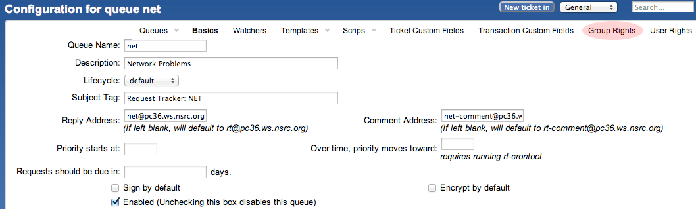

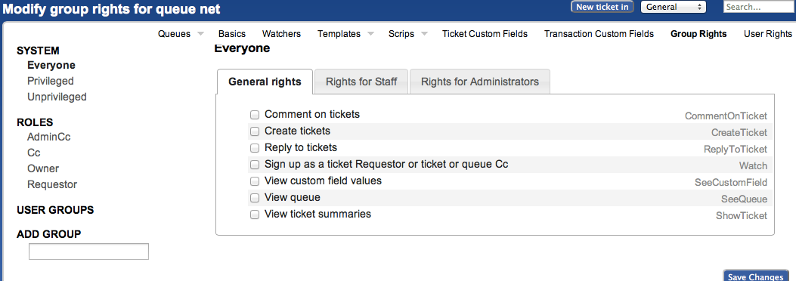

 
